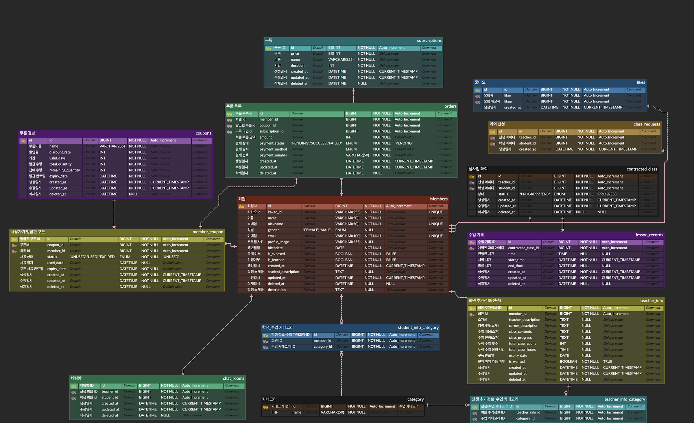

# 공통

## 기획 완료

팀원들과 각자 기획안을 작성한 후, 이를 바탕으로 최종 기획안을 선정하고, 컨설턴트님의 피드백을 반영하여 고도화하였습니다.

### 기획서 링크

[기획서 노션 링크](https://patch-country-94e.notion.site/174539f595068175af54f485cc38f558)

## 와이어프레임 완료

와이어프레임 작성을 완료했으며, 이를 바탕으로 프론트엔드 팀원들은 피그마 작업을, 백엔드 팀원들은 ERD 설계 작업을 진행할 예정입니다.

## ERD 설계

ERD 작성을 완료하였으며, 금요일 오후에 컨설턴트님께 피드백을 받을 예정입니다

# 개인

## JWT 토큰 학습

JWT 토큰에 대한 학습을 진행했습니다.

개인 블로그에 토큰 관련 내용을 추가적으로 학습하고 정리했습니다.

https://bangbaeking.tistory.com/153

## 지라

지라 이슈 및 스프린트 생성, 관리리

## 서버 아키텍처 설계

스프링 클라우드를 학습하며 서비스 아키텍처 설계를 진행 중입니다.

### Spring Cloud Gateway : SCG

- URL 주소에 대해서 아래 세부 경로에 따라 각각의 스프링 부트 어플리케이션에 분배하는 역할

### Spring Cloud Eureka

- 모니터링 서버로 Eureka client 설정을 해둔 서버를 Eureka Server 에 띄워준다.
- Server - 데이터를 제공하는 서버
- Client - 데이터를 받는 서버

### Spring Config

- Config Server:설정을 관리하는 서버로, 다양한 저장소에서 설정 값을 읽어 각 클라이언트에 전달한다.
- Config Repository: Config Server에서 Repository의 파일을 읽어 클라이언트에 전달한다.
