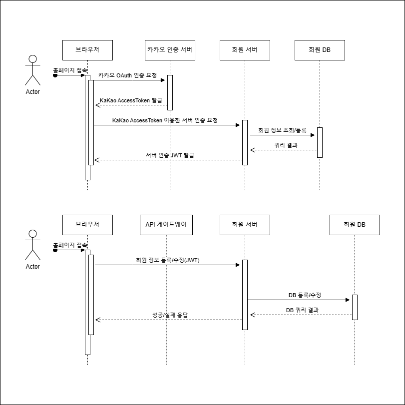

# 황인준 팀원 역할

## 1. 공통

### 1-1. 프로젝트 기획
[기획 기록 내용](https://patch-country-94e.notion.site/17b539f5950680e79db0ca4f92ce9ec8?pvs=73)

 

### 1-2. 와이어프레임 작성

 

### 1-3. ERD 설계

 

---

 

## 2. 개인 역할

### 2-1. 요구사항 명세서 작성
[요구사항 명세서 작성](https://patch-country-94e.notion.site/17b539f5950680e79db0ca4f92ce9ec8?pvs=73)

 

### 2-2. 시퀀스 다이어그램 작성
